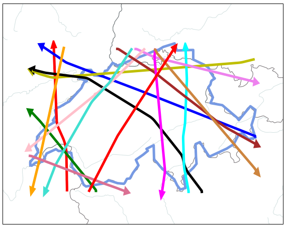

# Clustering aircraft trajectories with recursive DBSCAN

The clustering algorithm trdbscan is based on the recursive DBSCAN method introduced in the following scientific paper:

C. E. Verdonk Gallego, V. F. Fernando Gómez, F.J. Saez Nieto, and M.G. Martinez, "Discussion On Density-Based Clustering Methods Applied for Automated Identification of Airspace Flows," in *2018 IEEE/AIAA 37th Digital Avionics Systems Conference (DASC).* IEEE, 2018. p. 1-10.

As this method proves useful in the context of the identification of traffic flows (clusters of aircraft trajectories), the algorithm is used with the Swiss example provided by the [traffic library](https://github.com/xoolive/traffic).
Results are plotted with the [sectflow library](https://github.com/lbasora/sectflow) and can be compared with the DBSCAN method provided as an example in the [traffic documentation](https://traffic-viz.github.io/clustering.html), or the TrajClust method (also based on a recursive DBSCAN) supplied by the sectflow library and described in the following scientific paper:

L. Basora, V. Courchelle, J. Bedouet and T. Dubot, "Occupancy Peak Estimation from Sector Geometry and Traffic Flow," in Proceedings of the SESAR Innovation Days, 2018

The main advantages of the trdbscan method are:
* no need to specify the epsilon parameter of the DBSCAN algorithm, automatically at each iteration by the KNN elbow method
* depending on the decrement ratio, anomalies are classified: largest anomalies met at iteration 1 with a large epsilon are the first elements of the anomalies_ list.

Example: main traffic flows from flight trajectories over Switzerland on August 1st 2018

## Running the tests

If you want to run the demo_trdbscan notebook, you need to:
* install the [traffic library](https://github.com/xoolive/traffic)
* install the [sectflow library](https://github.com/lbasora/sectflow)
* copy the trdbscan.py class in your working folder

## Built With

On top of classical Python libraries (matplotlib, collections, numpy, logging, pandas), the following libraries are used:
* [kneed](https://github.com/arvkevi/kneed) - Knee point detection in Python
* [traffic library](https://github.com/xoolive/traffic) - Air traffic data processing in Python
* [scikit-learn](https://scikit-learn.org/stable/) - Machine Learning in Python
* [sectflow library](https://github.com/lbasora/sectflow) - Python library to identify air traffic flows

## Authors

* **Thomas Dubot** 

## License

This project is licensed under the MIT License - see the [LICENSE.md](LICENSE.md) file for details

